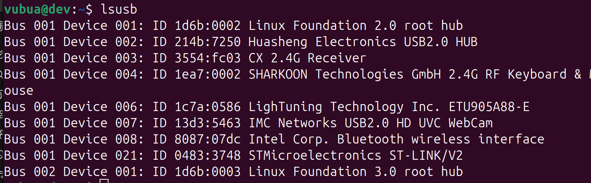
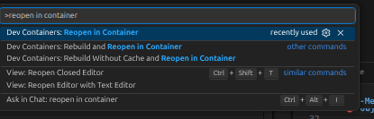
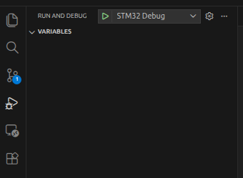
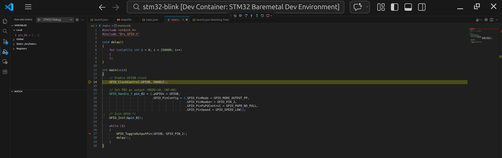

### Using Dev Container for debug with VS-Code

1. Prepare debug environment
* Ensure toolchain is available inside the container
* Check ST-Link connection
* Build the project before debugging

  

2. Open project in Dev Container

  

3. Start debug session
* Open Run and Debug tab in VSCode
* Select the correct debug configuration
* Press Start Debugging (F5)

  

4. Debug the program
* Observe breakpoints, variables, and call stack
* Step through code (Step Over / Step Into)
* Monitor program behavior in real time

  

