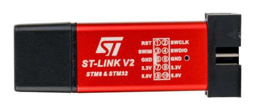

# Programming ARM from Scratch

This is a collection of examples that show how to program ARM microcontrollers
from scratch.

The examples show how to do bare-metal programming in assembly language,
how to write linker scripts, how to write GNU makefiles and how to switch
from assembly to C programming language without using any IDE or third-party
library or third-party HAL or CMSIS - everything is done from scratch.

## Required Hardware

#### 1. Development Board

Development board used in these examples is STM32F103CT6 blue-pill
made by WeAct Studio. It looks like this:

Here is a link to a project page on GitHub:
https://github.com/WeActStudio/BluePill-Plus

Here is a link to WeAct Studio official store on AliExpress:
https://weactstudio.aliexpress.com

#### 2. Debugger/Programmer

Debugger/programmer used in these examples is copy of ST-link V2 that you can
buy on AliExpress. It looks like this:

## Required Software

#### 1. ARM GNU Toolchain

ARM GNU toolchain includes GNU assembler, C and C++ compilers, GNU debugger and
GNU binutils.
Most of Linux distributions contain ARM GNU toolchain in their repository.
Such packages contain the following executables:
* `arm-none-eabi-as` --- Assembler
* `arm-none-eabi-gcc` --- C compiler
* `arm-none-eabi-ld` --- Linker
* `arm-none-eabi-gdb` --- Debugger
* `arm-none-eabi-objcopy` --- objcopy, part of GNU binutils

There is also official ARM GNU toolchain:
https://developer.arm.com/Tools%20and%20Software/GNU%20Toolchain

#### 2. STM32 Programming Toolset

These examples use `stlink` toolset to program and debug STM32 devices.
Here is a link to a project page on GitHub: https://github.com/stlink-org/stlink
Most of Linux distributions contain `stlink` toolset in their repository.

## Using Examples
All examples have prepared makefiles.

**Building:**
1. Run `make`.

**Writing program to main flash memory:**
1. Connect ST-link to PC.
2. Connect ST-link to development board.
3. Run `make flash`.

**Debugging:**
1. Connect ST-link to PC.
2. Connect ST-link to development board.
3. Run `make debug-all`.